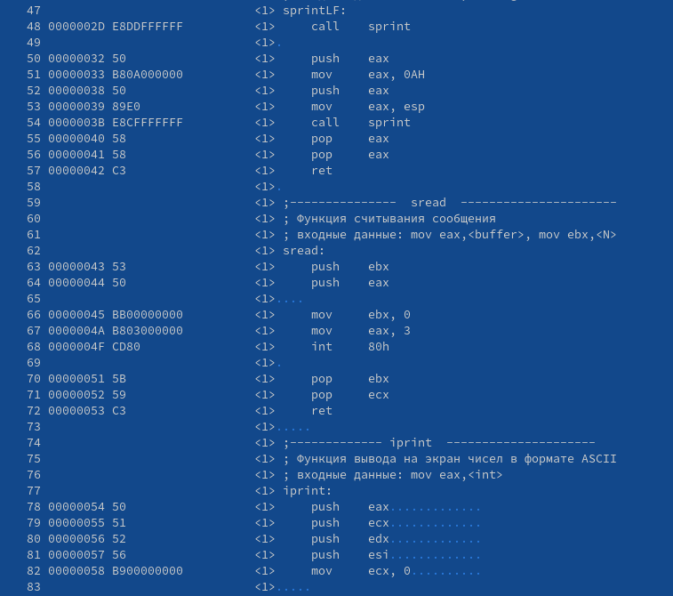

**РОССИЙСКИЙ УНИВЕРСИТЕТ ДРУЖБЫ НАРОДОВ**

**Факультет физико-математических и естественных наук**

**Кафедра прикладной информатики и теории вероятностей**

**ОТЧЕТ**

**по лабораторной работе № [8]{.ul}**

*[дисциплина: Архитектура компьютера]{.ul}*

[Студент: Ужаков Магомед.]{.ul}

Группа: НПИбд-02-22

**МОСКВА**

2022 г.

**Цель работы:**

Изучение команд условного и безусловного переходов. Приобретение навыков
написания программ с использованием переходов. Знакомство с назначением
и структурой файла листинга.

**Порядок выполнения лабораторной работы:**

**Реализация переходов в NASM.**

Создадим каталог для программ лабораторной работы №8, перейдем в него и
создадим файл lab8-1.asm (рис. 1).

{width="6.422916666666667in"
height="1.84375in"}

рис. 1. Создание каталога и файла lab8-1.asm

Инструкция jmp в NASM используется для реализации безусловных переходов.
Рассмотрим пример программы с использованием инструкции jmp. Введем в
файл lab8-1.asm следующий текст программы (рис. 2).

{width="3.6979166666666665in"
height="6.854166666666667in"}

рис. 2. Текст программы lab8-1

Создадим исполняемый файл и запустим его (рис. 3).

{width="5.625in"
height="1.8020833333333333in"}

рис. 3. Результат работы программы lab8-1

Таким образом, использование инструкции jmp \_label2 меняет порядок
исполнения инструкций и позволяет выполнить инструкции начиная с метки
\_label2, пропустив вывод первого сообщения. Инструкция jmp позволяет
осуществлять переходы не только вперед, но и назад. Изменим программу
таким образом, чтобы она выводила сначала 'Сообщение № 2', потом
'Сообщение № 1' и завершала работу. Для этого в текст программы после
вывода сообщения № 2 добавим инструкцию jmp с меткой \_label1 (т.е.
переход к инструкциям вывода сообщения № 1) и после вывода сообщения № 1
добавим инструкцию jmp с меткой \_end (т.е. переход к инструкции call
quit) (рис. 4).

{width="3.8854166666666665in"
height="6.760416666666667in"}

рис. 4. Измененный текст программы lab8-1

Создадим исполняемый файл и запустим его (рис. 5).

{width="6.135416666666667in"
height="1.6979166666666667in"}

рис. 5. Результат работы измененной программы lab8-1

Далее изменим текст программы lab8-1 так, чтобы сообщения выводились в
обратном порядке, затем запустим программу (рис. 6-7).

{width="3.4791666666666665in"
height="6.375in"}

рис. 6. Измененный текст программы lab8-1

{width="6.268055555555556in"
height="1.8125in"}

рис. 7. Результат работы измененной программы lab8-1

Использование инструкции jmp приводит к переходу в любом случае. Однако,
часто при написании программ необходимо использовать условные переходы,
т.е. переход должен происходить если выполнено какое-либо условие. В
качестве примера рассмотрим программу, которая определяет и выводит на
экран наибольшую из 3 целочисленных переменных: A, B и C. Значения для A
и C задаются в программе, значение B вводится с клавиатуры.

Создадим файл lab8-2.asm в каталоге \~/work/arch-pc/lab08 и введем в
него следующий текст программы (рис. 8-9).

{width="4.177083333333333in"
height="7.364583333333333in"}

{width="2.4479166666666665in"
height="3.2291666666666665in"}

рис. 8. Текст программы lab8-2 (1)

рис. 9. Текст программы lab8-2 (2)

Создадим файл и проверим его работу для разных значений B (рис. 10).

рис. 10. Работа
п{width="6.154861111111111in"
height="2.3854166666666665in"}рограммы lab8-2

Обратим внимание, что в данном примере переменные A и С сравниваются как
символы, а переменная B и максимум из A и С как числа (для этого
используется функция atoi преобразования символа в число). Это сделано
для демонстрации того, как сравниваются данные. Данную программу можно
упростить и сравнить все 3 переменные как символы (т.е. не использовать
функцию atoi). Однако если переменные преобразовать из символов в числа,
над ними можно корректно проводить арифметические операции.

**Изучение структуры файлы листинга.**

Обычно nasm создаёт в результате ассемблирования только объектный файл.
Получить файл листинга можно, указав ключ -l и задав имя файла листинга
в командной строке. Создадим файл листинга для программы из файла
lab8-2.asm (рис. 11).

{width="6.135416666666667in"
height="1.3020833333333333in"}

рис. 11. Создание файла листинга для программы lab8-2

Затем откроем этот файл (рис. 12-13).

{width="6.728472222222222in"
height="7.152777777777778in"}

рис. 12. Файл листинга программы lab8-2 (1)

{width="6.728472222222222in"
height="5.954861111111111in"}

рис. 13. Файл листинга программы lab8-2 (2)

Как видим на рис. 12 показаны некоторые функции, прописанные в файле
in_out.asm, который мы подключаем, на рис. 13 отображена непосредственно
часть текста программы lab8-2, разберем несколько строк из этого текста:

Строка 10: после обозначения строки видим 00000000 это адрес, т.е.
смещение машинного кода от начала текущего сегмента, поскольку строка 10
является самым начало сегмента SECTION .bss, ее адрес будет 00000000,
затем идет машинный код: \<res Ah\> показывает, что было зарезервировано
A байт (то есть 10 байт) памяти для переменной max, которая уже
отображена в самое правой строке: max resb 10 -- это код программы,
здесь мы выделяем память из 10 однобайтовых ячеек по адресу с меткой
max.

Строка 33: ее адрес уже равняется 00000122, 7FOC -- ассемблированная
инструкция jg, которая используется в этой строке для условной передачи
управления по результатам арифметического сравнения в 32 строке ecx и
\[C\].

Откроем файл с программой lab8-2.asm и в любой инструкции с двумя
операндами удалим один операнд. Выполним трансляцию с получением файла
листинга (14-15).

рис. 14. Удаление операнда msg1 в
{width="3.3125in"
height="2.40625in"}строке mov eax, msg1

{width="6.427083333333333in"
height="1.2083333333333333in"}

рис. 15. Листинг программы с удаленным операндом

В листинге отображается, что указана неверная комбинация операндов как
раз в той строке, в которой мы убрали один операнд.

**Порядок выполнения самостоятельной работы:**

Напишем программу (lab8-3) нахождения наименьшей из 3 целочисленных
переменных a, b и c. Значения для моего варианта (7 вариант) будут
следующими: a = 45, b = 67, c = 15. Создадим исполняемый файл и проверим
его работу.

{width="4.229166666666667in"
height="8.604166666666666in"}

рис. 16. Текст программы lab8-3

{width="5.65625in"
height="2.0416666666666665in"}

рис. 17. Результат работы программы

Напишем программу lab8-4

{width="4.791666666666667in"
height="6.927083333333333in"}

рис. 19. Текст программы (1)

{width="3.6875in"
height="4.739583333333333in"}

рис. 20. Текст программы (2)

{width="5.583333333333333in"
height="3.3333333333333335in"}

рис. 21. Результат работы программы

**Вывод:**

Во время выполнения лабораторной работы были изучены команды условного и
безусловного переходов, приобретены навыки написания программ с
использованием переходов, изучено назначение и структура файла листинга.
