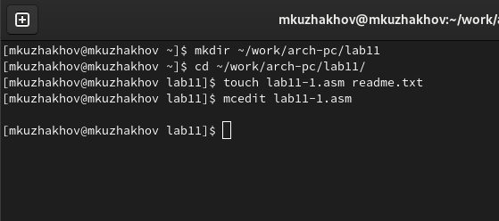
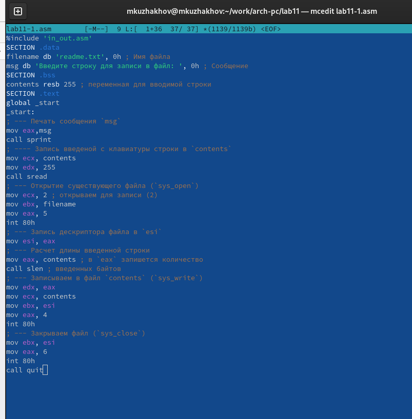
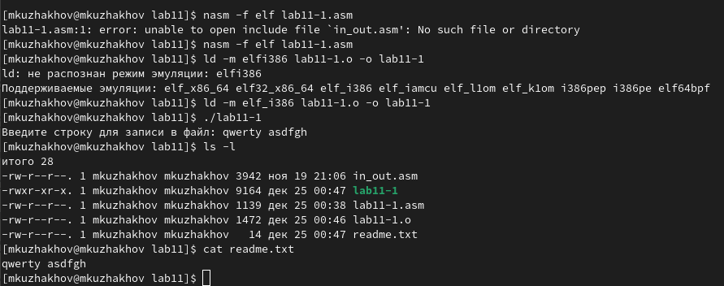
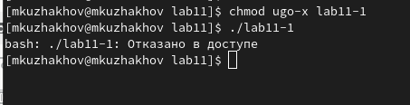
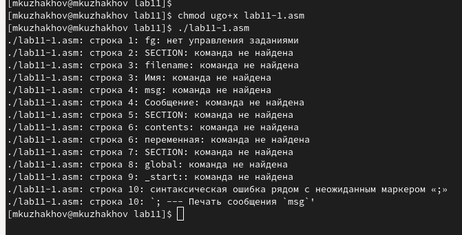
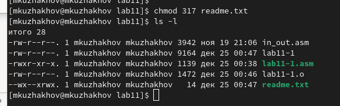
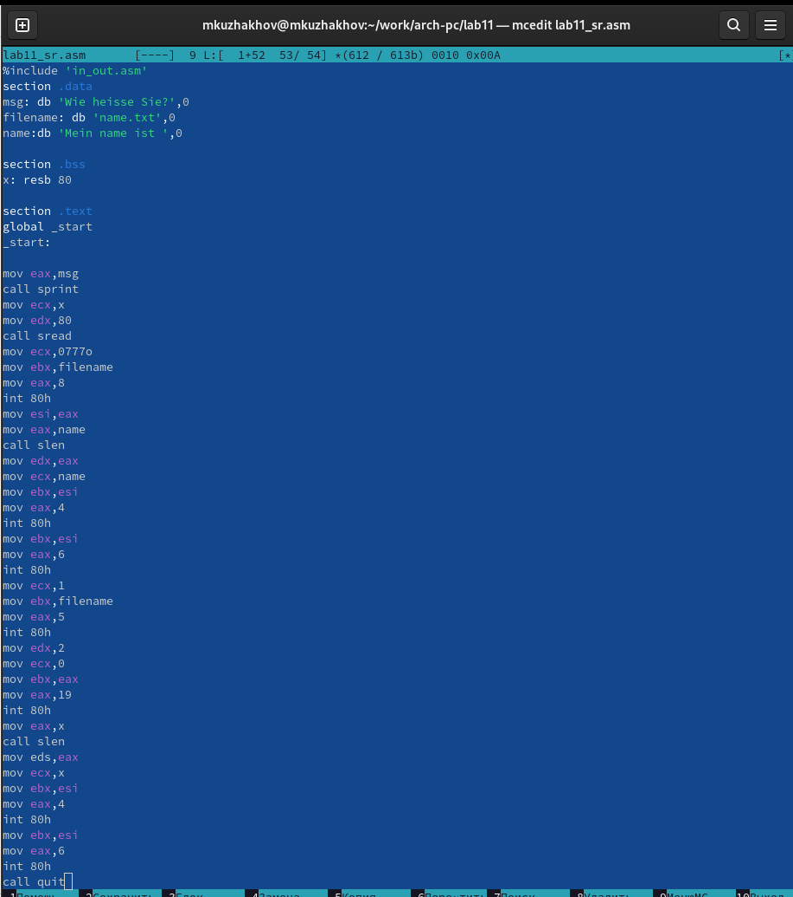
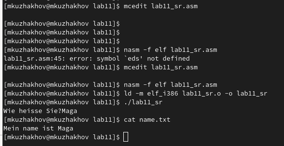

**РОССИЙСКИЙ УНИВЕРСИТЕТ ДРУЖБЫ НАРОДОВ**

**Факультет физико-математических и естественных наук**

**Кафедра прикладной информатики и теории вероятностей**

**ОТЧЕТ**

**по лабораторной работе № [11]{.ul}**

*[дисциплина: Архитектура компьютера]{.ul}*

[Студент: Ужаков Магомед]{.ul}

Группа: НПИбд-02-22

**МОСКВА**

2022 г.

**Цель работы:**

Приобретение навыков написания программ для работы с файлами.

**Порядок выполнения лабораторной работы:**

Создадим каталог для программ лабораторной работы № 11, перейдем в него
и создадим файлы lab11-1.asm и readme.txt (рис. 1).

{width="5.822916666666667in"
height="2.5833333333333335in"}

Рис. 1. Создание нужных файлов

Введем в файл lab11-1.asm текст программы (рис. 2). Создадим исполняемый
файл и проверим его работу (рис. 3).

{width="6.5in"
height="6.620833333333334in"}

Рис. 2. Текст программы lab11-1

{width="6.5in"
height="2.567361111111111in"}

Рис. 3. Результат работы программы

С помощью команды chmod ugo-x изменим права доступа к исполняемому файлу
lab11-1, запретив его выполнение, затем попытаемся выполнить исполняемый
файл (рис. 4).

{width="4.71875in"
height="1.2083333333333333in"}

Рис. 4. Изменение прав доступа к файлу и проверка

Как видим, у нас все получилось, теперь мы не можем запустить файл из-за
отказа в доступе (ugo отвечает за выбор принадлежности прав, в нашем
случае это все пользователи, - отвечает за отмену прав, а x отвечает за
право на исполнение).

Теперь с помощью команды chmod изменим права доступа к файлу lab11-1.asm
с исходным текстом программы, добавив права на исполнение и попытаемся
запустить его (рис. 5).

{width="6.5in"
height="3.3027777777777776in"}

Рис. 5. Разрешение выполнения исходного текста программы как
исполняемого файла и попытка выполнить файл

Эти ошибки вызваны тем, что мы запустили на выполнение не исполняемый
файл.

Теперь предоставим права доступа к файлу readme.txt в соответствии с
вариантом, данном в ЛР 11 (У меня вариант 15). В моем случае набор прав
доступа в символьном виде будет следующим: -wx \--x rwx, в двоичном: 010
101 010. И проверим корректность выполнения (рис. 6).

{width="6.03125in"
height="1.8854166666666667in"}

Рис. 6. Предоставление прав доступа к файлу readme.txt и проверка
правильности выполнения команды

Как видим, все получилось.

**Порядок выполнения самостоятельной работы:**

Напишем программу (рис. 7), которая будет работать по следующему
алгоритму:

1)  Вывод приглашения "Как Вас зовут?"

```{=html}
<!-- -->
```
1)  Ввод с клавиатуры своих фамилии и имени.

```{=html}
<!-- -->
```
1)  Создание файла с именем name.txt.

```{=html}
<!-- -->
```
1)  Запись в файл сообщения "Меня зовут".

```{=html}
<!-- -->
```
1)  Дополнительная запись в файл строки, введенной с клавиатуры.

```{=html}
<!-- -->
```
1)  Закрытие файла.

Создадим исполняемый файл и проверим его работу. Также проверим наличие
файла и его содержимое с помощью команд ls и cat (рис. 8).

{width="6.5in"
height="7.336111111111111in"}

Рис. 7. Текст программы lab11-yeahboysoonendofsession

{width="6.09375in"
height="3.1354166666666665in"}

Рис. 8 Проверка работы исполняемого файла и проверка наличия файла
name.txt и его содержимого

**Вывод:**

В ходе выполнения лабораторной работы мы приобрели навыки написания
программ для работы с файлами.
